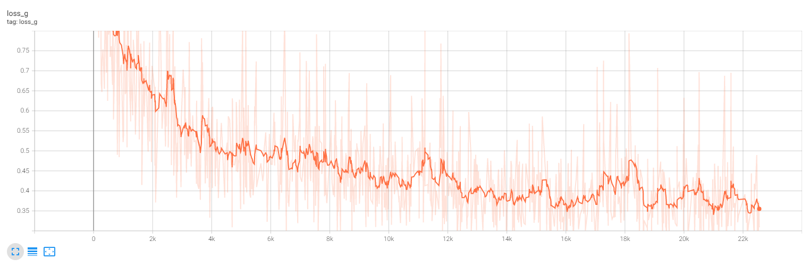
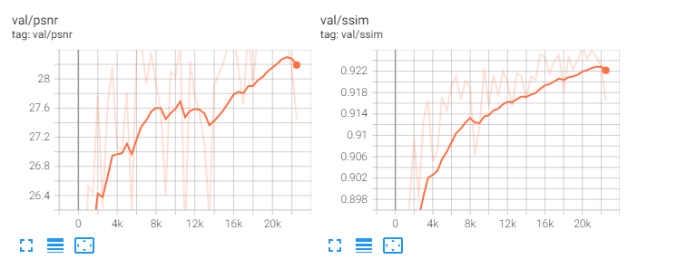
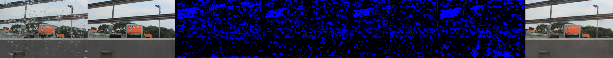

## attentive-gan-derainnet-pytorch

This is the pytorch implementation of CVPR2018 paper "Attentive Generative Adversarial Network for Raindrop Removal from A Single Image". You can refer to their paper for details [[Paper Link]](https://arxiv.org/abs/1711.10098). This model consists of a attentive attentive-recurrent network, a contextual autoencoder network and a discriminative network. Using convolution lstm unit to generate attention map which is used to help locating the rain drop, multi-scale losses and a perceptual loss to train the context autoencoder network. Thanks for the origin author [Rui Qian](https://github.com/rui1996)

#### If you find the resource useful, please cite the original paper and my repo [attentive-gan-derainnet-pytorch](https://github.com/cskkxjk/attentive-gan-derainnet-pytorch) 

```
@InProceedings{Qian_2018_CVPR,
author = {Qian, Rui and Tan, Robby T. and Yang, Wenhan and Su, Jiajun and Liu, Jiaying},
title = {Attentive Generative Adversarial Network for Raindrop Removal From a Single Image},
booktitle = {The IEEE Conference on Computer Vision and Pattern Recognition (CVPR)},
month = {June},
year = {2018}
}
```
## Train Model
```
python train.py --seed randomseed --train_dir train_dir --val_dir validation_dir --batch_size bs --device device_num --checkpoint_every 500 --validate_every 500 --visualize_every 500
```
You may monitor the training process using tensorboard tools

During my experiment the `loss G` drops as follows:  


The Image `PSNR` and `SSIM` between generated image and clean label image raises as follows:  


The Image derain results as follows:
(input, gt, att_map_0,..,att_map_4, generated)


## Test Model
```
coming soon
```

## TODO
- [ ] Prepare Inference Code

